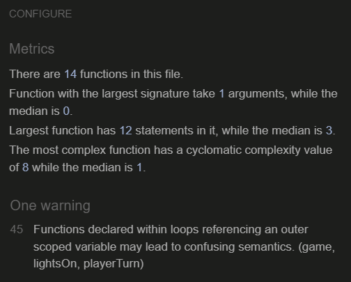

# Memorrow

Memorrow is an arrow based memory game, to test your mind and reaction skills. The site will feature an interactive functioning game in which the player must try and beat their own best score in a "Simon-says" style memory game using either the corresponding arrow keys *OR* clicking the icons on screen.


## User Stories 
|Story No.|Story|
| ------------- | ------------- |
|1| As a First-time User, <br> I want to be able to play a simple game quickly <br> so I can test my memory without having to read a bunch of instructions. <br><br> I know I am done when I have a simple game that is intuitive and self explanatory, and has simple instructions on how to play. |
|2|As a repeat user, <br> I want to be able to track my highest score <br> so I can compete with my self and try and improve. <br><br> I know I am done when I have a score tracking system that keeps track of my current and high score.|
|3|as the Creator, <br> I want to be able to be able to play the game with arrow keys or mouse clicks <br> So I have the option between the 2, and other users can play with their preference. <br><br> When both the onClick and onKeyDown functions work interchangably.|
|4|As a First-time user,<br> I want to be able to find the "how to play" instructions quickly and easily the first time I visit the site <br> So I can easily learn the rules if I am not understanding. <br> <br> I know I am done when an easy to see and universally recognised icon to represent info button drops down a menu with the instructions inside.|
|5|As the creator, <br> I want a visually appealing game that is simple and pleasing to look at.<br> So it is satisfying to use and other players will be enticed to play. <br> I know I am done when I have a simple, appealing game that has eye catching colours and uses simple shapes and symmetry. |

***

## Wireframes
Below is the design that I can use to build the site. I have used the user story numbers to link where I can meet the goal in my design. This will help me to think about the users needs as I build the page.


***

## Features

## Existing Features

 __DropDown Intructions__

- A menu that, when clicked, shows the instructions on how to interact with the game.

__Arrow Squares__

- The main image of the game, showing "↑", "↓", "←" or "→", in a "□".
- Light up 1 at a time in an increasing length in a random order that must then be repeated by the player.

__Score__

- A current score tracker, increasing by 1 each successfully completed round.
- A high score tracker, that remembers your most recent highest score.

__Start game__

- A start game button so you can begin a game or restart your current game(resetting your current score).


## Features Left to Implement

- When you achieve a new high score, put in a name that is saved to local storage with the highscore info, and accessible from a button that opens a modal with the name and score.

- have a confetti/firework effect when you beat previous score.

- difficulty option, removing/adding arrows to make it easier/harder, with a leaderboard for each difficulty.

## Testing

This is a sample of shots of what the site looks like on different devices. 

#### Desktop
|Firefox 120.0.1|Chrome 120.0.6099.225|
| ------------- | ------------------ |
|||


### small 

### medium


#### Mobile

##### Safari iOS Phone 17.2


### Validator Testing
- HTML
    - index.html: No errors were returned when passing through the official W3C validator<br> 
    [W3C HTML validator link!](https://validator.w3.org/nu/?doc=https%3A%2F%2Fsamuelmackay.github.io%2Fminiature-commission-painter%2Findex.html)


- CSS 
 
    - style.css: No errors were returned when passing through the offical w3c css validator:<br>
    [W3C CSS Validator link!](http://jigsaw.w3.org/css-validator/validator?lang=en&profile=css3svg&uri=https%3A%2F%2Fsamuelmackay.github.io%2FMemory-game%2Fassets%2Fcss%2Fstyle.css&usermedium=all&vextwarning=&warning=1)

- JS 
    - scripts.js: no errors were returned when passing through jsint.com
    - modalscript.js: no errors were returned when passing through jsint.com 
### Manual Testing
- I have tested that this page works in different web browsers.
- I have tested that the project is responsive and works with different device sizes. It looks good and functions as normal. 
- I have tested the interactiviy of the game and it reacts as expected.
- I have tested that all text and fonts are readable and easy to understand.

### Bugs
#### Bug 1

- The font awesome icons are getting in the way of the click event, and it is confusing the code. Changed line 21 in scripts.js from target to currentTarget.

- old code:
```
function newGame() {
    game.currentGame = [];
    game.playerMoves = [];
    game.score = 0;

    for (let arrow of document.getElementsByClassName("arrow")) {
        if (arrow.getAttribute("data-listener") !== "true") {
            arrow.addEventListener("click", (e) => {
                if (game.currentGame.length > 0 && !game.turnInProgress) {
                    let move = e.target.getAttribute("id");
                    game.lastButton = move;
                    game.playerMoves.push(move);
                    lightsOn(move);
                    playerTurn();
                }
            });
            arrow.setAttribute("data-listener", "true");
        }
    }
    showScore();
    addTurn();
}
```
- new code:
```
function newGame() {
    game.currentGame = [];
    game.playerMoves = [];
    game.score = 0;

    for (let arrow of document.getElementsByClassName("arrow")) {
        if (arrow.getAttribute("data-listener") !== "true") {
            arrow.addEventListener("click", (e) => {
                if (game.currentGame.length > 0 && !game.turnInProgress) {
                    let move = e.currentTarget.getAttribute("id");
                    game.lastButton = move;
                    game.playerMoves.push(move);
                    lightsOn(move);
                    playerTurn();
                }
            });
            arrow.setAttribute("data-listener", "true");
        }
    }
    showScore();
    addTurn();
}
```

#### Bug 2
- When first loading the page, high score was setting to Null instead of "0" if there wasnt anything in local storage. I had added a "game.highScore++" at line 129 and it was breaking the loop of updating highscore if it was lower than current score.

- old code:
```
function playerTurn() {
    let i = game.playerMoves.length - 1;
    if (game.currentGame[i] === game.playerMoves[i]) {
        if (game.currentGame.length === game.playerMoves.length) {
            game.score++;
            game.highScore++;
            showScore();
            addTurn();
        }
    } else {
        let showGameOverModal = document.getElementById("game-over-modal");
        showGameOverModal.style.display = "block";
        console.log(game.score);
        console.log(game.highScore);
        if (game.score >= game.highScore){
        highScore();
    }
}
}
```
- new code:
```
function playerTurn() {
    let i = game.playerMoves.length - 1;
    if (game.currentGame[i] === game.playerMoves[i]) {
        if (game.currentGame.length === game.playerMoves.length) {
            game.score++;
            showScore();
            addTurn();
        }
    } else {
        let showGameOverModal = document.getElementById("game-over-modal");
        showGameOverModal.style.display = "block";
        console.log(game.score);
        console.log(game.highScore);
        if (game.score >= game.highScore){
        highScore();
    }
}
}
```

#### Bug 3
- Couldn't get the game-over modal to active when you input the wrong sequence. needed to change the names of the "let" objects in modalscripts.js for the game-over-modal and change it to look for the [1] instead of [0] in the span, and then link it in the player turn function at line 133, 134 in scripts.js.

- old code:
```
// Get the modal
let modal = document.getElementById("game-over-modal");

// Get the <span> element that closes the modal
let span = document.getElementsByClassName("close")[1];

// When the user clicks the button, open the modal 
span.onclick = function() {
  modal.style.display = "none";
}
```
```
gameOverModal.show()
```
- new code:
```
// Get the modal
let showGameOverModal = document.getElementById("game-over-modal");

// Get the <span> element that closes the modal
let gameOverSpan = document.getElementsByClassName("close")[1];

// When the user clicks the button, open the modal 
gameOverSpan.onclick = function() {
  showGameOverModal.style.display = "none";
}
```
```
let showGameOverModal = document.getElementById("game-over-modal");
showGameOverModal.style.display = "block";
```

#### Bug 4
- the click function i created for my start button was going off at ANY click rather than just ones targeting the start button, 
fixed it by giving the event listener a target to attach to.

- Old code:
```
document.addEventListener("DOMContentLoaded", (event) => {
    document.getElementById("start-button");
    addEventListener ("click", (e) => {
        newGame();
    });
  });
```
- New code:
```
document.addEventListener("DOMContentLoaded", (event) => {
    let start = document.getElementById("start-button");
    start.addEventListener ("click", () => {
      newGame()
    });
  });
```

#### Bug 5
- When clicking start game when the previous lightup class is still active, it breaks the game. added arrays for the timeout and interval timers set for the lightOn and showTurn funtions, so that clicking newGame() clears and resets those timers.

- old code:
```
let game = {
    currentGame: [],
    playerMoves: [],
    score: 0,
    highScore: 0,
    turnNumber: 0,
    lastButton: "",
    turnInProgress: false,
    choices: ["up", "left", "right", "down"]
  };  

function showTurns() {
    game.turnInProgress = true;
    game.turnNumber = 0;
    setInterval(function () {
        lightsOn(game.currentGame[game.turnNumber]);
        game.turnNumber++;
        if (game.turnNumber >= game.currentGame.length) {
            clearInterval(turns);
            game.turnInProgress = false;
        }
    }, 1000);
}

function lightsOn(arr) {
    document.getElementById(arr).classList.add("light-up");
    setTimeout(function () {
        document.getElementById(arr).classList.remove("light-up");
    }, 400);
}


```
- new code:
```
let game = {
    currentGame: [],
    playerMoves: [],
    score: 0,
    highScore: 0,
    turnNumber: 0,
    lastButton: "",
    turnInProgress: false,
    choices: ["up", "left", "right", "down"],
    timer: [],
    interval: []

  };

  function newGame() {
    for (let timerId of game.timer) {
      clearTimeout (timerId);
    }
    for (let intervalId of game.interval) {
      clearInterval (intervalId);
    }
    ...
  }

function showTurns() {
    game.turnInProgress = true;
    game.turnNumber = 0;
    let turns = setInterval(function () {
        lightsOn(game.currentGame[game.turnNumber]);
        game.turnNumber++;
        if (game.turnNumber >= game.currentGame.length) {
            clearInterval(turns);
            game.turnInProgress = false;
        }
    }, 1000);
    game.interval.push(turns);
}

function lightsOn(arr) {
    document.getElementById(arr).classList.add("light-up");
    let timerId = setTimeout(function () {
        document.getElementById(arr).classList.remove("light-up");
    }, 400);
    game.timer.push(timerId);
}

```


- ### Unfixed Bugs
 - n/a

### User stories Testing
|Story No.|Result|Story/ Evidence|
| ------------- | ------------- | ------------- |
|1|<font color="green">Test Pass</font>| <br> As a First-time User, <br> I want to be able to play a simple game quickly <br> so I can test my memory without having to read a bunch of instructions. <br><br> I know I am done when I have a simple game that is intuitive and self explanatory, and has simple instructions on how to play. <br><br>Evidence:<br>.<br> |
|2|<font color="green">Test Pass</font> |As a repeat user, <br> I want to be able to track my highest score <br> so I can compete with myself and try and improve. <br><br> I know I am done when I have a score tracking system that keeps track of my current and high score.<br><br>Evidence:<br>. <br> |
|3|<font color="green">Test Pass</font> |as the Creator, <br> I want to be able to be able to play the game with arrow keys or mouse clicks <br> So I have the option between the 2, and other users can play with their preference. <br><br> When both the onClick and onKeyDown functions work interchangably.<br><br>Evidence:<br> <br> the key down event listener triggers the click event, so both clicking and arrow keys work to play. |
|4|<font color="green">Test Pass</font> |As a First-time user,<br> I want to be able to find the "how to play" instructions quickly and easily the first time I visit the site <br> So I can easily learn the rules if I am not understanding. <br> <br> I know I am done when an easy to see and universally recognised icon to represent info button drops down a menu with the instructions inside.<br><br>Evidence:<br> .<br>|
|5|<font color="green">Test Pass</font> |As the creator, <br> I want a visually appealing game that is simple and pleasing to look at.<br> So it is satisfying to use and other players will be enticed to play<br> When I have a simple, appealing game that has eye catching colours and uses simple shapes and symmetry. <br><br>Evidence:<br> .<br> |

### Accessibility Testing

To check the colors, fonts, accessibilty and performance I used Lighthouse in the Google devtools. The results are shown below:

| Home  |
| ------- |
|  |


## Deployment

### Cloning & Forking
#### Fork
1. On GitHub.com, navigate to the [SamuelMacKay/Memory-game](https://github.com/SamuelMacKay/Memory-game) repository.
2. In the top-right corner of the page, click Fork.
3. By default, forks are named the same as their parent repositories. You can change the name of the fork to distinguish it further.
4. Add a description to your fork.
5. Click Create fork.

#### Clone
1. Above the list of files click the button that says 'Code'.
2. Copy the URL for the repository.
3. Open Terminal. Change the directory to the location where you want the cloned directory.
4. Type git clone, and then paste the URL
5. Press Enter.

### Local Deployment
1. Sign up to [Gitpod](https://gitpod.io/)
2. Download the Gitpod browser extension.
3. On GitHub.com, navigate to the [SamuelMacKay/Memory-game](https://github.com/SamuelMacKay/Memory-game) repository.
4. Above the list of files click the button that says 'Gitpod'.

### Remote Deployment 
 The site was deployed to Github pages. If you have forked/cloned the repository the steps to deploy are:
 1. On GitHub.com, navigate to your repository.
 2. Navigate to the settings tab.
 3. Click on the tab called 'pages' on the left hand side.
 4. From the source drop down list under the heading Build and deployment, select main.
 5. The page will then provide the link to the website.

 The live link can be found here - [Memorrow](https://samuelmackay.github.io/Memory-game/)

## Credits

### Content
- Processes from the CI Love Running project was used to help create this website <br> [CI Love Running](https://code-institute-org.github.io/love-running-2.0/index.html)
- Proccesses from the CI Love Maths project was used to help create this website <br> [CI Love Maths](https://github.com/Code-Institute-Solutions/love-maths-2.0-sourcecode.git)
- Proccesses from the CI testing with jest was used to help create this website <br> [CI Jest Testing](https://github.com/Code-Institute-Solutions/Jest_Testing_Part2.git)
- HTML, CSS and Javascript code help was taken from w3schools <br>[W3Schools](https://www.w3schools.com/)
- Buttons and Modal are from Bootstrap5 <br> [Bootstrap](https://getbootstrap.com/docs/5.3)
- Keydown for arrow key functionality was taking from <br>[Stackoverflow](https://stackoverflow.com/questions/57681634/press-an-arrow-key-using-a-html-button-or-simply-press-it)

### Media

#### Icons
- All page Icons <br> [Font Awesome](https://fontawesome.com/)